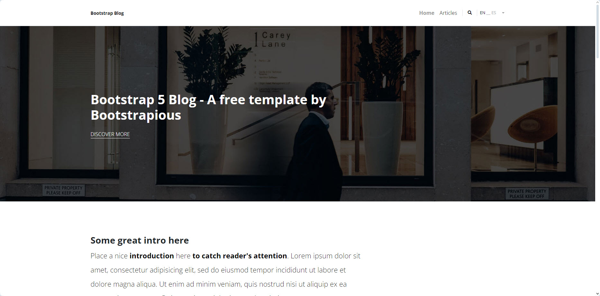
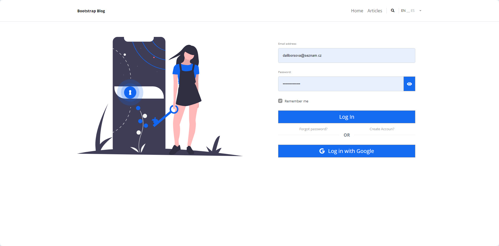
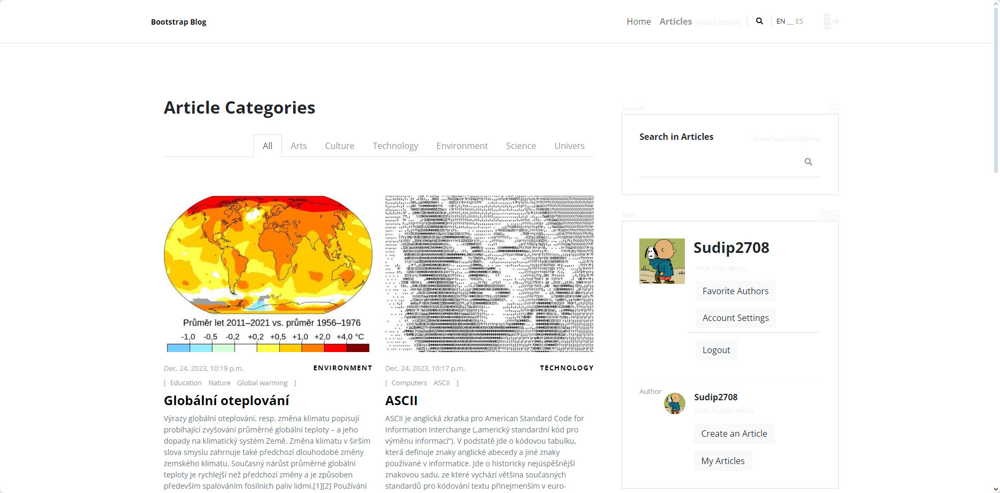
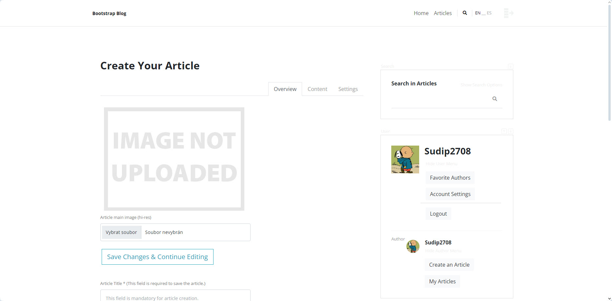
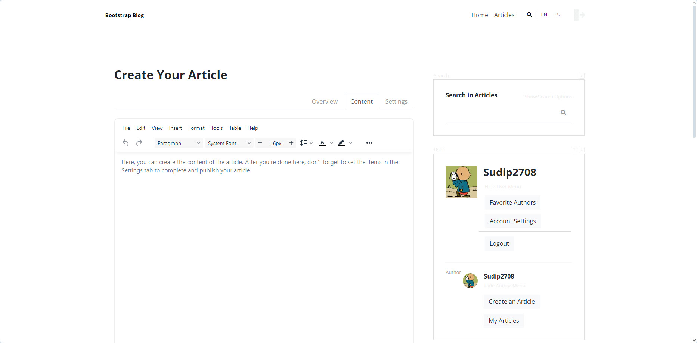
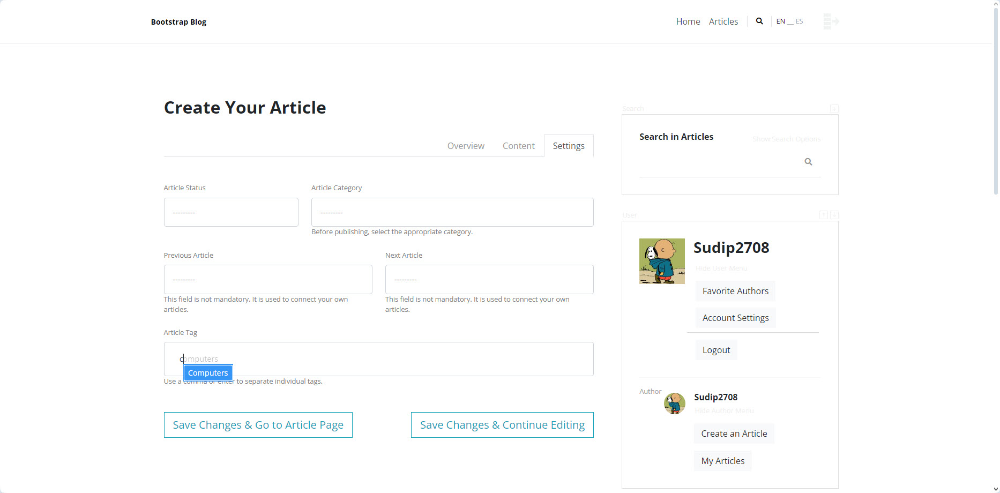
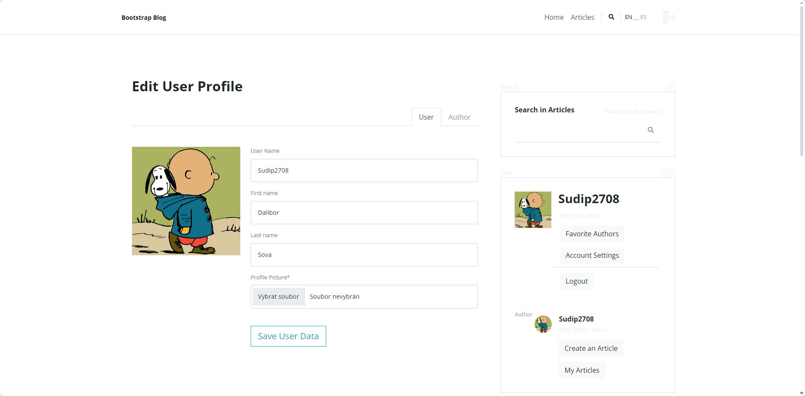
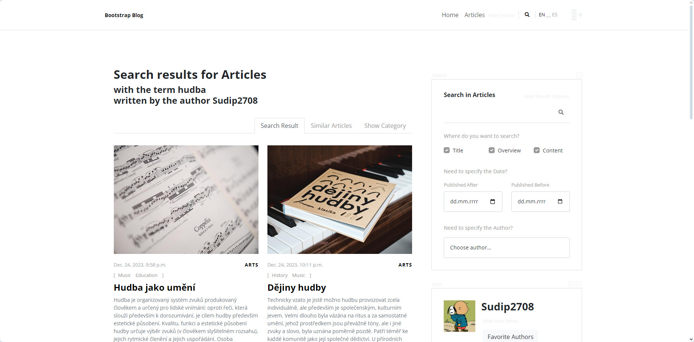
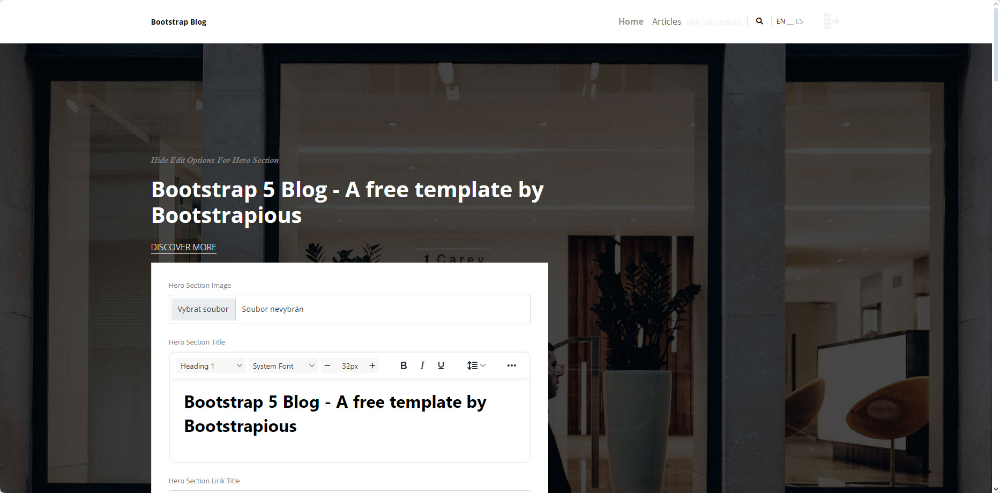

# Django Blog Web

Smyslem tohoto projektu bylo naučit se struktuře Django, jeho možnostem, ale také k nalezení optimálního přístupu k řešení výzev, které programování sebou přináší a osvojení si pracovních postupů.

## Popis projektu

Samotný projekt je zaměřen na stránky pro vytváření a správu mediálních článků. Základem projektu je tato šablona: https://bootstrapious.com/p/bootstrap-blog a jeho páteří jsou:

- Stránky pro zobrazení a vyhledávání v publikovaných článcích
- Stránky pro přihlášení a správu uživatele (a případného autora)
- Stránky pro vytvoření, úpravu a mazání článků
- Homepage s editovatelným obsahem pro superuživatele

Jedná se o můj třetí projekt (druhý dělaný v Django), který mě má posunout na cestě k práci programátora.

## Moje cesta

Python jsem se začal učit před více než dvěma roky a přibližně před rokem jsem úspěšně absolvoval 3-měsíční kurz, který mě obohatil o úvodní náhled do využití Pythonu pro programování webových aplikací.

Po kurzu jsem si pár měsíců osovojoval nabité zkušenosti na aplikaci psané ve Flasku. Ta byla velmi zjednodušenou verzí tohoto projektu. Doufal jsem, že po jejím dokončení již budu připraven pro pracovní trh. Ale pro práci z domova, s jejíž vidinou se toto vše učím, to stále bylo málo a mě došlo, že Flask nestačí a je potřeba se dobře dorozumět i s Django.

Nejprve jsem projekt dělaný ve Flasku přepsal i do Django, abych pochopil, co je pojí. Následně jsem obdržel testovací úkol, který měl prověřit moje schopnosti. Zprvu jsem úkol vnímal jako snadný, neboť jeho zadání nebylo moc odlišné od toho, co už jsem dělal. Ale po čase mi došlo, že je toho ještě mnoho, co neví a co nutně potřebuji vědět, abych se mohl o takovouto práci ucházet. Z testovacího úkolu jsem udělal učební materiál.

## Učební proces

Snažil jsem se tam, kde to šlo, jít jinou cestou, abych se co nejvíce naučil. Tomu jsem přizpůsobil i tempo a přednost mělo pochopit vše tak, abych tomu plně rozuměl. Tím se vše extrémně zpomalilo a z projektu, který jsem si původně myslel, že budu mít na měsíc, se stala téměř půlroční záležitost.

Jestli to byl dobře investovaný čas, teprve asi uvidím. Osobní pokrok je pro mě patrný už jen v tom, že všemu, co je v kódu, plně rozumím a jsem schopný diskutovat o výhodách a nevýhodách zvolených postupů. Hlavní prioritou celého projektu bylo dobře porozumět a ovládnout Django, tak abych si s klidným svědomím mohl v tomto oboru hledat práci.

## Pracovní postupy

Veškeré mé pracovní postupy se ustálily na rozebrání nejčastějších přístupů k dané věci s popisem výhod a nevýhod. Diagnostikování chyb a hledání nápravy se neskutečně zjednodušilo. Prakticky nikdy jsem nenarazil na to, že bych si něco vymyslel a pak se to nedalo provést. To ale paradoxně i trochu zdržovalo, protože jsem spoustu věcí, co jsem dělal, zase zrušil pro jejich zbytečnost. Ale tím vším jsem se učil.

## Role ChatGPT

Nedocenitelným pomocníkem se mi stala bezplatná verze ChatGPT, která i přes pár let starou databázi stále držela krok s tím, co jsem od ní potřeboval. Dá se říct, že téměř vše, co jsem potřeboval vědět, jsem se dozvěděl díky ní. Naučil jsem se dobře specifikovat své dotazy tak, abych dostával velmi relevantní odpovědi. ChatGPT se mi stal asistentem, s jehož pomocí vím, že se nemusím obávat žádné výzvy. Mít takto propracovaný statistický nástroj k ruce je pro programátora opravdová radost, kor když se s ním dá domluvit normální řečí.

## Závěr

Samotný projekt tedy není plně hotov, a nebude-li to po mně někdo chtít, asi ani nikdy plně hotový nebude. Ale splnil vše, co jsem od něj očekával a vzhledem k mé momentální finanční situaci mi nedává moc smysl věnovat dále čas věcem, které již dobře umím. Rád bych se dále rozvíjel na projektech, za které budu i finančně odměněn.

Z tohoto pohledu je projekt naprosto hotov, neb jeho úkolem bylo dostat mě na úroveň, kdy s klidným svědomím mohu v daném oboru začít hledat práci a postupně se dále vyvíjet a růst.

Pokud si tyto řádky čte potenciální zaměstnavatel, kterému je kód v tomto projektu primárně určen, doufám, že odhlédne od toho, co ještě nevím, a bude pro něj podstatné, jak zacházím s tím, co už znám. Snažil jsem se jít co nejvíce cestou modulárního přístupu, ale zároveň se vyhnout přílišné fragmentaci.

Popisky mohou být pro někoho obsáhlejší, ale bral jsem to tak, že se mažou snáze než dopisují. 

Na unit testy mi už vůbec nevyšel čas. Možná se k nim dostanu, pokud o mě nebude mít pracovně nikdo zájem. Ale věřím, že testování není ani tak náročné na schopnosti, jako spíše na čas.

Celkově jsem připraven. Pokud tedy sháníte někoho, na koho byste se mohli spolehnout, že se bude snažit odvést dokonalou práci, protože bere svou práci jako svoji vizitku, pak jsem tu pro vás. Programování mě baví, mám ho v krvi a těším se na další výzvy a nové schopnosti.

## Podrobný rozbor projektu

[• Popis všech URL adres projektu](read_me_data/01_url_list.md)

[• Podrobný popis pohledů](read_me_data/02_view_list.md)

[• Seznam všech instalovaných pip](read_me_data/03_pip_install.md)

[• Podrobný popis hlavičky ](read_me_data/04_header.md)

[• Úplný strom projektu s popisem souborů](read_me_data/05_tree.md)

## Screen Shots

